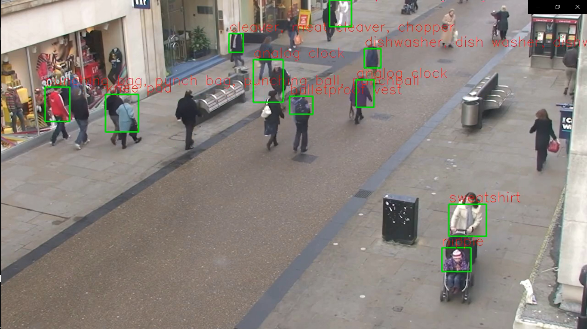

# Detecting and classifying objects using Computer Vision and Deep Learning
Computer Vision & AI model using a short video from Youtube for object detection and classification

## Youtube video
'https://www.youtube.com/watch?v=pk96gqasGBQ&ab_channel=TRIDE'

## Python packages
- OpenCV (cv2)
- numpy
- tensorflow
- tensorflow.keras
- pytube
